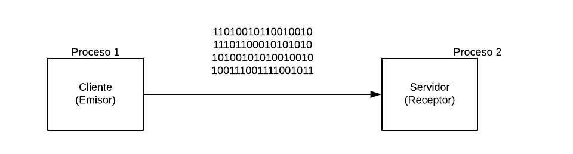
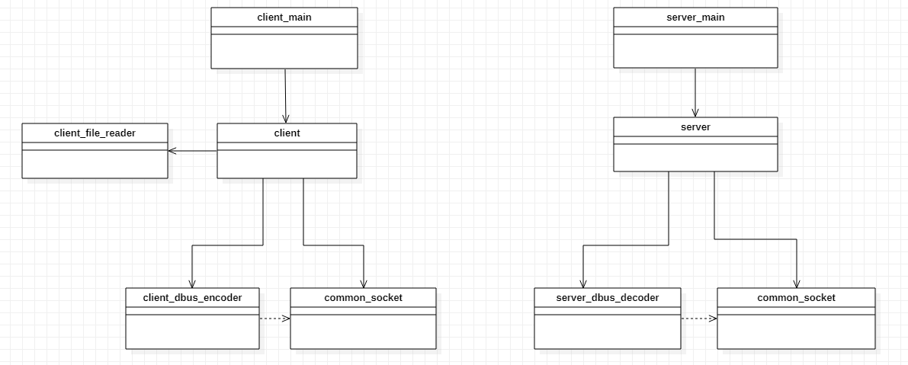
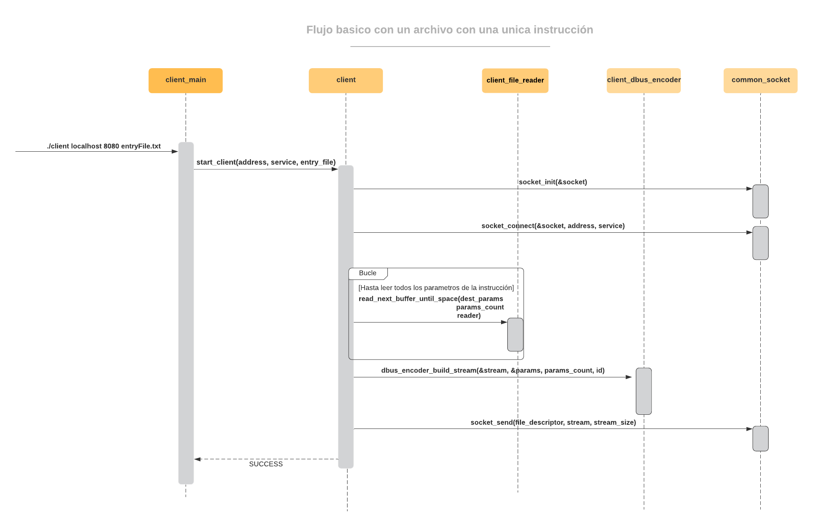

  
  

# 
Trabajo práctico 1 - Protocolo DBus

### 
Taller de programación 1 - Veiga - 1er Cuatrimestre 2020

  

| | |
|---|---|
|  Alumno | Federico Jure  |
| Padrón  |  97598 |
| Email   | fedejure@gmail.com |
## [
Repositorio fuente](https://github.com/FedeJure/DBusProtocol)

  

----------------------------------

### descripción del trabajo realizado
 Se utilizo el lenguaje C, y se usaron librerias estandar y la libreria de socket de linux.
> El programa modela una resolucion acotada del protocolo DBus utilizado para la comunicacion entre distintos procesos que permite llamar a un procedimiento de un proceso externo.  Como el nombre lo indica, bus, es una vía en donde se envia información de un emisor hasta un receptor, en forma de un stream de bytes. 
  Para que funcióne, se requiere que ambas partes sepan armar y entender el mensaje y para ésto se utiliza un protocolo en este caso DBus.
 
En el siguiente ejemplo se muestra a grandes razgos lo que se quiere lograr con este programa.

 
 

 
El programa consiste en dos ejecutables, un cliente y un servidor.
   
__Cliente__: Es el encargado de interactuar con el usuario mediante la entrada de un archivo o mediante la entrada estandar, procesar los datos ingresados, armar un mensaje que respete el protocolo, y finalmente enviarlo al servidor. 
  
__Servidor:__ El servidor estára funcionando en un determinado puerto esperando recibir un mensaje de un cliente mediante una conexion por socket. Una vez establecida una conexión exitosa y recibido un mensaje, se decodificara el mismo respetando el protocolo a seguir y ejecutando la accion requerida. [En este caso no se ejecutara ninguna accion mas que imprimir por pantalla la acción requerida].
  

> Cabe destacar que el protocolo utilizado por ejemplo en las distribuciones actuales basadas en Unix, es mucho mas extenso y admite una variedad mas grande de parametros y tipos de datos a enviar. Ya que es una resolucion resumida y con fines academicos, muchas decisiones de diseño e implementacion fueron tomadas teniendo esto en cuenta.

-----------------------------------

## Modelo de dominio

### Common
* common_socket
    > Permite realizar una conexion por socket, tanto para cliente como para servidor. 
* common_utils
    > Funciones utiles.

### Client
* client_main
    > Punto de entrada del __client__, procesa los argumentos de la ejecución, y se responsabiliza de enviar al cliente el archivo desde el cual leer (ya séa __stdin__ o __un archivo de texto__).
* client
    > Recibe un archivo de donde leer las instrucciones que el usuario quiere enviar a travez del __bus__, establece una conexion con el servidor utilizando __socket__
* client_file_reader
    > Procesa el archivo provisto por el __client__ y permite extraer todos los datos necesarios para el protocolo.
* client_dbus_encoder
    > Dado una cantidad de parametros requerida por el protocolo, arma un stream de bytes.

### Server
* server_main
    > Punto de entrada del __server__, procesa los argumentos de la ejecución.
* server
    > Inicia un __socket__ en modo de servidor y queda a la espera de la conexion de un __client__; una vez establecida, lee y procesa los bytes recibidos utilizando el __server_dbus_decoder__. Al finalizar la lectura de cada instruccion enviada por el __client__ imprime por __stdout__ una representacion de lo que sería la ejecucion de dicha instrucción.
* server_dbus_decoder
    > Dado un stream de bytes, extrae de él toda la informacion necesaria respetando el protocolo, y la almacena en un DTO __dbus_t__ el cual mantiene una estructura ordenada y de facil acceso para usar con el mensaje recibido.

---------------
En el siguiente diagrama se puede ver a grandes razgos las dependencias de los modelos de del dominio.

---------------
